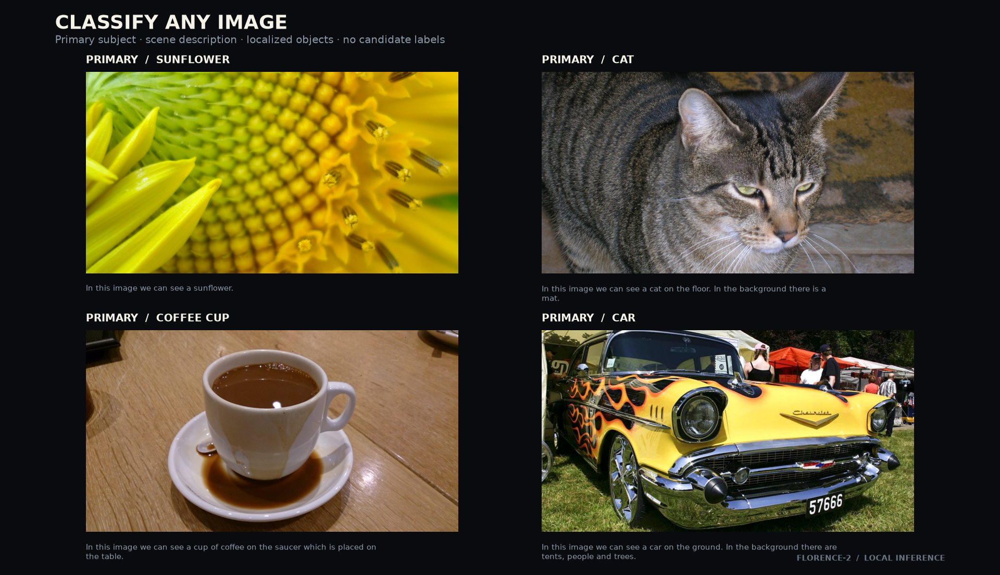
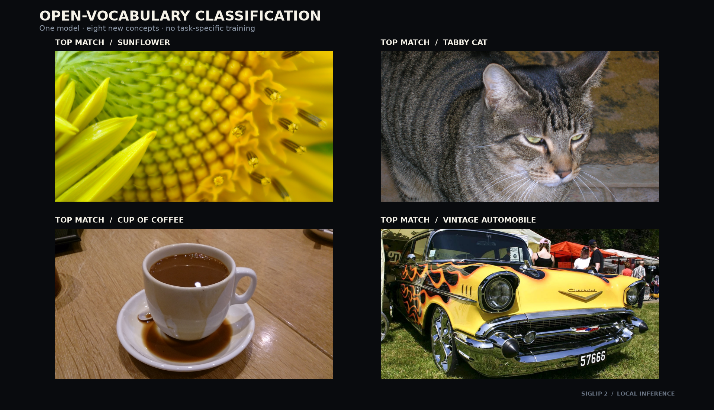
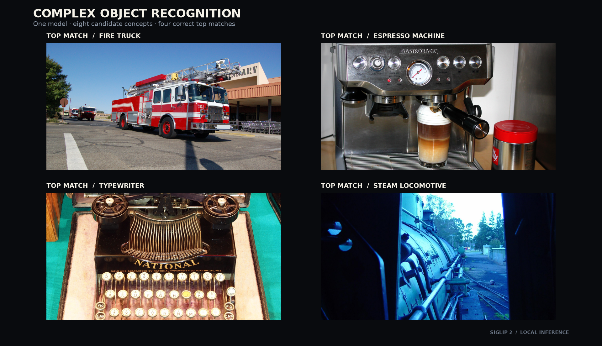
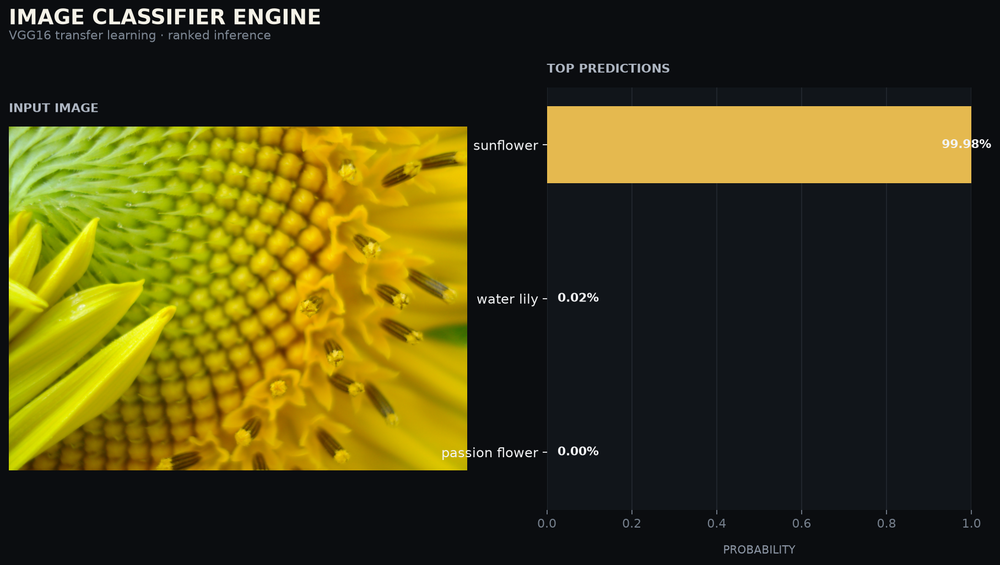

# Image Classifier Engine

[](https://github.com/jollyzachary/image_classifier/actions/workflows/ci.yml)

A local computer vision toolkit for scene analysis, open-vocabulary
classification, and custom transfer-learning models.

- Florence-2 describes scenes, identifies a primary subject, and returns object
  locations without a predefined label set.
- SigLIP 2 ranks user-supplied concepts without training a new model.
- VGG16 transfer learning trains a classifier for a folder-structured dataset
  and saves a reusable checkpoint.

All three workflows run on the local machine. No hosted inference service is
required.

## Results

### General image analysis



Florence-2 identified the primary subject in four unrelated images and returned
a scene description, detected objects, and bounding boxes. The complete output,
including the pinned model revision, is stored in
[`classify-any-results.json`](docs/assets/classify-any-results.json).

### Open-vocabulary classification



SigLIP 2 received the same eight candidate labels for four unrelated images. It
ranked sunflower, tabby cat, cup of coffee, and vintage automobile first for the
corresponding images. The candidate set and ranked scores are stored in
[`open-vocabulary-results.json`](docs/assets/open-vocabulary-results.json).

SigLIP scores are independent semantic-match scores. They are useful for
ranking the supplied concepts and are not calibrated class probabilities.

### Complex object recognition



The same open-vocabulary engine ranked fire truck, espresso machine,
typewriter, and steam locomotive first for four public reference images. Every
image was evaluated against the same eight candidate concepts without
task-specific training. The complete rankings are recorded in
[`complex-object-results.json`](docs/assets/complex-object-results.json).

### Transfer-learning classifier



The reproducible training example uses three classes from the official Oxford
102 Flowers splits: sunflower, water lily, and passion flower. A frozen VGG16
feature extractor and a trained classifier head correctly identified 58 of 60
held-out images, or 96.7 percent. A separate public-domain sunflower image was
classified as sunflower with 99.98 percent probability.

The training history, seed, architecture, sample counts, and test metrics are
stored in [`demo-metrics.json`](docs/assets/demo-metrics.json). This compact run
validates the training and inference pipeline for three selected classes; it is
not a 102-class benchmark.

## Architecture

```text
Image -> Florence-2 -> caption + objects + primary subject

Image + candidate labels -> SigLIP 2 -> ranked semantic matches

Folder dataset -> VGG16 transfer learning -> checkpoint -> top-k prediction
```

The modules separate data loading, model construction, training, checkpointing,
closed-set prediction, open-vocabulary inference, and scene analysis. Each
workflow is available through the command line, and the general-analysis engine
also exposes a small Python API.

## Quick start

### Manual setup

Python 3.10 or newer is required.

```bash
git clone https://github.com/jollyzachary/image_classifier.git
cd image_classifier
python3 -m venv .venv
source .venv/bin/activate
python -m pip install --upgrade pip
```

Install the core transfer-learning dependencies:

```bash
python -m pip install -r requirements.txt
```

Install the additional dependencies for Florence-2 and SigLIP 2:

```bash
python -m pip install -r requirements-vision.txt
```

On Windows PowerShell, activate the environment with:

```powershell
.\.venv\Scripts\Activate.ps1
```

The first foundation-model run downloads model weights from Hugging Face and
caches them locally.

### Give this to your AI agent

Copy this instruction into a coding agent with terminal access:

```text
Set up Image Classifier Engine from
https://github.com/jollyzachary/image_classifier on this computer.

Read README.md first. Detect the operating system and verify that Git and
Python 3.10 or newer are available. Ask before installing system packages.

If a checkout already exists, preserve its uncommitted changes and use it.
Otherwise, clone the repository. Create an isolated .venv, install
requirements-vision.txt and requirements-dev.txt, then download the verified
complex-object examples with:

python scripts/download_complex_object_demo.py

Run the four-image zero-shot example documented under "Reproduce the recorded
examples," run the unit tests, and report the top match for each image plus the
paths to the generated JSON and figure.

Keep downloaded images, model caches, checkpoints, generated artifacts,
credentials, and machine-specific paths out of Git. Do not commit, push, or
change system settings.
```

## Usage

### Analyze an image

No checkpoint or candidate labels are required.

```bash
python main.py classify-any ./example.jpg \
  --device auto \
  --json ./artifacts/analysis.json \
  --output ./artifacts/analysis.png
```

Supply additional image paths to reuse one loaded model across a batch. Use
`--output-dir` instead of `--output` when processing multiple images.

The same engine can be embedded in another Python project:

```python
from classify_any import AnyImageClassifier

classifier = AnyImageClassifier(device="auto")
result = classifier.classify("example.jpg")

print(result["primary_subject"])
print(result["description"])
print(result["objects"])
```

`classify_many()` processes several paths with the same loaded model.

### Rank candidate concepts

Provide at least two labels:

```bash
python main.py zero-shot ./example.jpg \
  --labels "tabby cat" "golden retriever" "red fox" "snow leopard" \
  --top-k 3 \
  --device auto \
  --output ./artifacts/open-vocabulary-prediction.png
```

For repeatable or larger label sets, place one label per line in a text file and
use `--labels-file`. Multiple image paths can be processed in one command.
`--output-dir` saves one visualization per image, and `--json` saves structured
results.

### Train a custom classifier

The dataset root must contain matching `train`, `valid`, and `test` class
directories:

```text
dataset/
|-- train/
|   |-- class_a/
|   `-- class_b/
|-- valid/
|   |-- class_a/
|   `-- class_b/
`-- test/
    |-- class_a/
    `-- class_b/
```

Train and save a checkpoint:

```bash
python main.py train ./dataset \
  --epochs 5 \
  --learning-rate 0.001 \
  --hidden-units 512 \
  --device auto \
  --save-dir ./artifacts
```

Run a prediction:

```bash
python main.py predict ./example.jpg ./artifacts/checkpoint.pth \
  --top-k 5 \
  --category-names cat_to_name.json \
  --output ./artifacts/prediction.png
```

Device selection supports `auto`, `cpu`, `cuda`, and `mps`. The `--gpu` option
is retained as a shortcut for `--device cuda`.

## Reproduce the recorded examples

### General analysis and open vocabulary

```bash
python -m pip install -r requirements-vision.txt
python scripts/download_zero_shot_demo.py

python main.py classify-any \
  data/open-vocabulary-demo/sunflower.jpg \
  data/open-vocabulary-demo/tabby-cat.jpg \
  data/open-vocabulary-demo/coffee-cup.jpg \
  data/open-vocabulary-demo/vintage-car.jpg \
  --device auto \
  --json docs/assets/classify-any-results.json

python main.py zero-shot \
  data/open-vocabulary-demo/sunflower.jpg \
  data/open-vocabulary-demo/tabby-cat.jpg \
  data/open-vocabulary-demo/coffee-cup.jpg \
  data/open-vocabulary-demo/vintage-car.jpg \
  --labels-file examples/open-vocabulary-labels.txt \
  --top-k 3 \
  --device auto \
  --json docs/assets/open-vocabulary-results.json

python scripts/render_classify_any_demo.py
python scripts/render_zero_shot_demo.py \
  --results docs/assets/open-vocabulary-results.json
```

The downloader verifies every source image against its recorded SHA-256 digest.
The source images remain outside version control.

### Complex objects

```bash
python scripts/download_complex_object_demo.py

python main.py zero-shot \
  data/complex-object-demo/fire-engine.jpg \
  data/complex-object-demo/espresso-machine.jpg \
  data/complex-object-demo/typewriter.jpg \
  data/complex-object-demo/steam-locomotive.jpg \
  --labels-file examples/complex-object-labels.txt \
  --top-k 4 \
  --device auto \
  --json docs/assets/complex-object-results.json

python scripts/render_zero_shot_demo.py \
  --results docs/assets/complex-object-results.json \
  --output docs/assets/complex-object-demo.png \
  --title "COMPLEX OBJECT RECOGNITION" \
  --subtitle "One model · eight candidate concepts · four correct top matches"
```

The example downloader records each source URL and verifies each file before
inference. The images remain outside version control.

### Transfer learning

```bash
python -m pip install -r requirements-demo.txt
python scripts/prepare_flower_demo.py

python train.py ./data/flowers-demo \
  --epochs 12 \
  --hidden-units 256 \
  --batch-size 10 \
  --seed 42 \
  --device auto \
  --save-dir ./artifacts/demo \
  --metrics-output ./artifacts/demo-metrics.json

python scripts/download_demo_image.py
python predict.py ./data/demo-input/sunflower.jpg \
  ./artifacts/demo/checkpoint.pth \
  --top-k 3 \
  --category-names cat_to_name.json \
  --device auto \
  --output ./artifacts/demo-prediction.png
```

The preparation script uses the published Oxford 102 Flowers splits and writes
the selected classes into the directory structure expected by the trainer.
Datasets, checkpoints, downloaded weights, and generated run artifacts are
excluded from version control.

## Project structure

```text
checkpoint.py          Checkpoint serialization and reconstruction
classify_any.py        Florence-2 scene analysis and Python API
data_preprocessing.py  Dataset validation, transforms, and data loaders
image_processing.py    Prediction preprocessing and visualization
label_mapping.py       Category-name mapping loader
main.py                Unified command dispatcher
model.py               VGG16 model construction, training, and evaluation
predict.py             Checkpoint prediction command
runtime.py             CPU, CUDA, and Apple Silicon device selection
train.py               Transfer-learning command
zero_shot.py           SigLIP 2 batch classification
docs/assets/           Recorded outputs and figures
examples/              Candidate-label examples
notebooks/             Project lineage notebook
scripts/               Reproducible data and figure utilities
tests/                 Unit tests
```

## Model and checkpoint trust

The Florence-2 loader executes model code supplied by its Hugging Face
repository. The implementation pins the model to an immutable revision and
loads safetensor weights. Review provenance before changing the model identifier
or revision.

PyTorch checkpoints should also come from a trusted source. This repository
stores state dictionaries and reconstruction metadata rather than serialized
model objects, and it does not distribute a trained checkpoint.

## Development

```bash
python -m pip install -r requirements-dev.txt
python -m ruff check .
python -m ruff format --check .
python -m pytest -q
```

Continuous integration runs compilation, linting, formatting, and unit tests on
every pull request and every push to `main`.

## Project history

The project began in 2023 as part of Udacity's AI Programming with Python
Nanodegree. The current repository expands that transfer-learning exercise into
three maintained workflows with repeatable local examples. The
[project lineage notebook](notebooks/udacity_project_archive.ipynb) records that
progression.

## Data and model attribution

This project uses PyTorch, TorchVision pretrained weights, Google's
Apache-2.0-licensed
[SigLIP 2 model](https://huggingface.co/google/siglip2-base-patch16-224),
Microsoft's MIT-licensed
[Florence-2 model](https://huggingface.co/microsoft/Florence-2-base-ft), and the
[Oxford 102 Flowers dataset](https://www.robots.ox.ac.uk/~vgg/data/flowers/102/)
created by Maria-Elena Nilsback and Andrew Zisserman. Third-party data and model
weights remain subject to their respective terms.

The recorded examples use the public-domain
[Sunflower close-up](https://commons.wikimedia.org/wiki/File:Sunflower_-a_close_up_view.jpg),
[Tabby cat](https://commons.wikimedia.org/wiki/File:Tabby-cat.jpg), and
[Retro old car](https://commons.wikimedia.org/wiki/File:Retro_old_car_oldtimer.jpg)
photographs, plus the CC0
[Cup Coffee](https://commons.wikimedia.org/wiki/File:Cup_Coffee.jpg) photograph.

The complex-object example uses the public-domain
[Air Force fire truck](https://commons.wikimedia.org/wiki/File:Air_Force_fire_truck.jpg)
and
[steam locomotive](https://commons.wikimedia.org/wiki/File:Steam_locomotive_(1).jpg)
photographs, plus the CC0
[espresso machine](https://commons.wikimedia.org/wiki/File:Espressso_machine_2014.JPG)
and
[National Typewriter No. 5](https://commons.wikimedia.org/wiki/File:National_Typewriter_No5,_foto.JPG)
photographs.

## License

Original code in this repository is available under the [MIT License](LICENSE).
